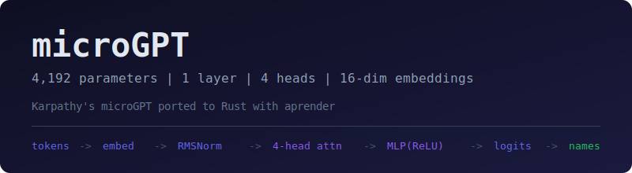

[](https://github.com/paiml/microgpt/actions)
[](LICENSE)
[](https://paiml.github.io/microgpt/)

<p align="center">
  
</p>

# microGPT

Karpathy's [microGPT](https://karpathy.github.io/2026/02/12/microgpt/) ported
to Rust with [aprender](https://github.com/paiml/aprender).

A 4,192-parameter GPT trained on 32K names using character-level tokenization.
Everything else is just efficiency.

## Architecture

| Component | Value |
|-----------|-------|
| Embedding dim | 16 |
| Attention heads | 4 (head_dim=4) |
| Layers | 1 |
| Context length | 16 |
| Vocab | 27 (a-z + BOS) |
| Parameters | 4,192 |
| Normalization | RMSNorm (per-row) |
| Activation | ReLU |
| Optimizer | Adam (beta1=0.85, beta2=0.99) |

### Port differences from the Python original

The Rust implementation is **mathematically equivalent** to Karpathy's Python
code (verified to 1.19e-7 max logit difference), but uses different
computational strategies:

| Aspect | Python (Karpathy) | Rust (this repo) |
|--------|-------------------|-------------------|
| Sequence processing | One token at a time with KV cache | Full sequence with causal mask |
| Attention projections | Single [16,16] matrix, split after | Per-head [16,4] matrices |
| Weight layout | `linear(x, w)` = `w @ x` | `x @ w` (stored transposed) |
| Autograd | Custom scalar `Value` class | aprender tensor autograd |
| Embedding | Direct row lookup | One-hot matmul (differentiable) |

The parity is validated by CI on every push: Python generates reference
logits with seed=42, Rust loads the same weights and compares.

## Install

```bash
cargo install --path .
```

## Usage

```bash
cargo run --release
```

Trains for 5,000 steps on CPU, then generates 20 names.
Loss converges from ~3.3 (random baseline for 27 classes: `-ln(1/27)`)
to ~2.0 producing name-like outputs (e.g. "karila", "maria", "misha").

### Introspection examples

```bash
cargo run --example inspect_model      # apr inspect / apr tensors equivalent
cargo run --example explain_attention   # apr explain --kernel equivalent
cargo run --example trace_forward       # apr trace --payload equivalent
```

## Provable Contracts

See [`contracts/microgpt-v1.yaml`](contracts/microgpt-v1.yaml) for formal
invariants covering:

- **One-hot encoding** — exactly one 1.0 per row, shape `[n, C]`
- **RMSNorm** — `x / sqrt(mean(x^2) + 1e-5)`, shape preserved, output finite
- **Causal mask** — lower-triangular 0.0, upper `-1e9`, shape `[n, n]`
- **Tokenizer roundtrip** — `decode(tokenize(s)) == s` for `[a-z]*`
- **Adam optimizer** — second moment non-negative, step counter monotonic
- **Forward pass** — output shape `[n, 27]`, all values finite
- **Python parity** — logit difference < 1e-3 against Karpathy's code
- **Badge integrity** — CI badge targets real workflow, all HTTPS
- **README claims** — every table value verified against source constants
- **Book integrity** — heading hierarchy, chapter existence, no XSS links

The README itself is under contract — `tests/readme_contract.rs` validates
that every architectural claim matches the source constants. If you change
`N_EMBD` from 16 to 32 without updating this table, `cargo test` fails.

## Documentation

Full architecture walkthrough, `apr` introspection examples, and contract
reference: **[paiml.github.io/microgpt](https://paiml.github.io/microgpt/)**

## Dependencies

Only [aprender-core](https://crates.io/crates/aprender-core) (pure Rust ML
framework, published on crates.io) and `rand`. No path or git dependencies.

## License

MIT
